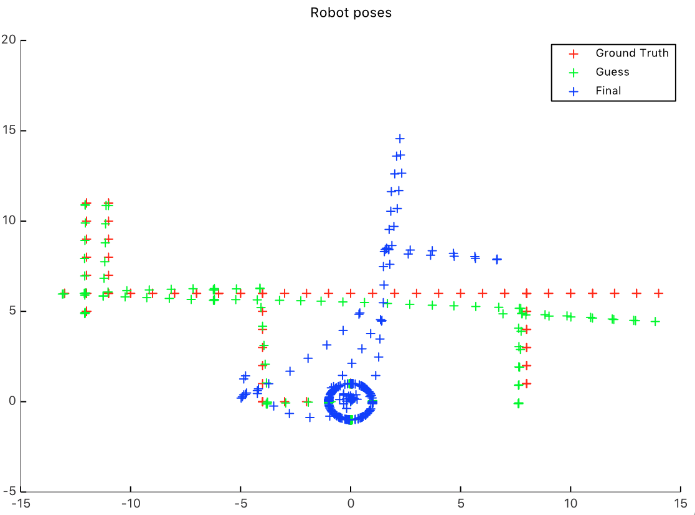

# Graph Based SLAM (Bearing only)

### Introduction

Simultaneous Localisation And Mapping (SLAM) is a stochastic map building method which allows consistent robot navigation without requiring an a *priori* map. The map is built incrementally as the robot observes the environment with its on-board sensors and, at the same time, is used to localize the robot. Typically, SLAM has been performed using range-bearing sensors, but the development of a SLAM implementation using only bearing measurements is desirable as it permits the use of sensors such as CCD cameras, which are small, reliable and cheap.

However, the outcome of SLAM with bearing only sensors is strictly dependent on the **initalitialization**. This, in turn, depends on the generation of the dataset, hence on how the robot moves in the environment and what kind of measuraments retrieve from the landmarks that observers. The main difficulty is due to the fact that a single bearing does not allow to reconstruct a 2D position. In fact, at least two bearings need to be used.

This projects provides two implemented ways of initialize the landmark pose through the bearing sensors. Among these, only the one that uses triangulation with two bearings works efficiently. 

The problem of SLAM is than solved using a graph-based approach. In the graph, the nodes corresponds the robot and the landmarks positions, while the edges represent the constraint between poses. Once such a graph is constructed, the error is minimized using a *least-squares* approach (**Gauss-Newton** - manifold version with damping factor to prevent singularities).

### Initialization

The dataset providing all the measuraments is in ```g2o``` format. Hence a parser has been used to acquire the information is form of struct array. The robot poses have been reconstructed using the origial odometry and the transitions provided in the dataset. Differently, the landmarks' poses have been reconstructed using two different strategies.

- The first, proposed by [Traa](http://cal.cs.illinois.edu/~johannes/research/LS_line_intersect.pdf) that uses a **non iterative least-squares** approach to find the **intersection of lines**. Therefore, for each landmark all bearing measuraments have been stored. All of these bearing measuraments and the robot poses from which the robot observers the landamark have been used to generate the lines. For instance, *K* lines, may all intersect at a unique point, only in pairs, or in other ways. A unique solution to the *intersection* of the set of lines in a least-squares sense can be obtained by *minimize the sum of squared distances*. This method, that allows to use all the measuraments from each landmarks, does not seem to perform well. The picture below illustrates the outcome. In this experiment, 7 measuraments for each landmark have been used (therefore, not all landmark have been reconstructed since few of them have less than 7 bearings).




- The second, differently seem to perform well. This has been implemented following a basic **geometric triangulation** proposed by [Bailey](http://www-personal.acfr.usyd.edu.au/tbailey/papers/icra03.pdf) which allows to *reconstruct a landmark position from two robot poses and their relative orientations and bearings*. In order to find a good initial guess of the landmark pose, the tringulation needs to come from two distant robot poses, with different bearings and orientations. This in fact produces the reconstruction of less landmarks compared to the ones originally provided but with a sufficiently good initial guess that allows the robot to reconstruct the map and to localize much more accurately compared to the previous approach. In this experiment, 110 landmarks of 142 have been reconstructed. 


### Least-Squares Error Minimization

-intro to Least Squares
-manifold version
-use damping factor to prevent singularities
-solve sparse linear system
-plot matrix H and chi

#### Run

The project has been developed in ```octave```. This can be run as following:

```matlab
octave LsSlam.m
```

#### Copyright

This work has been developed incorporating code previously implemented by *Giorgio Grisetti*, *Bartolomeo Della Corte* and *Dominik Schlegel*, from *Sapienza University of Rome*.


